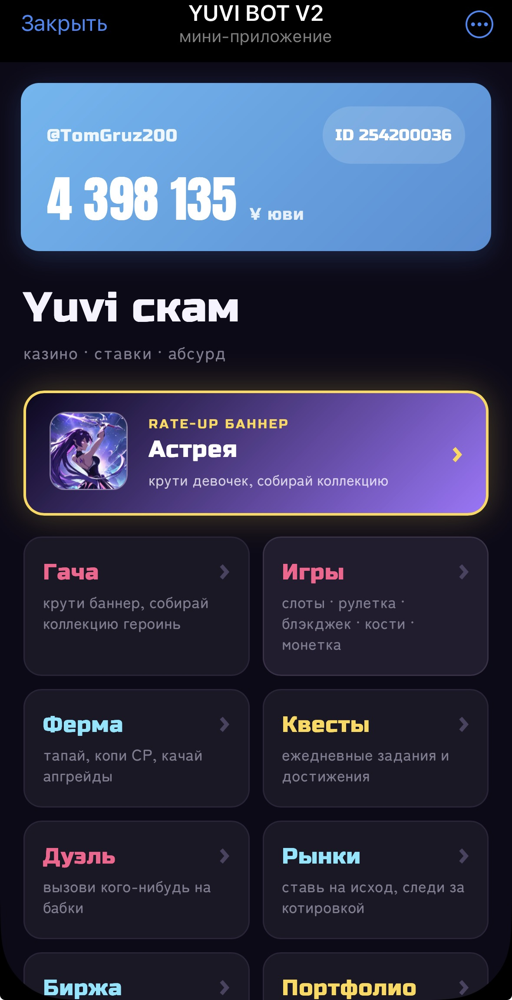
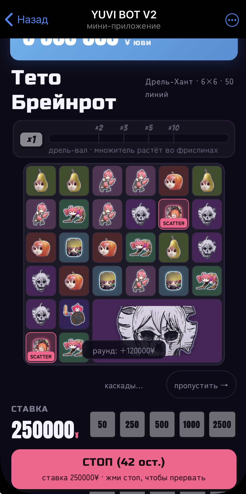
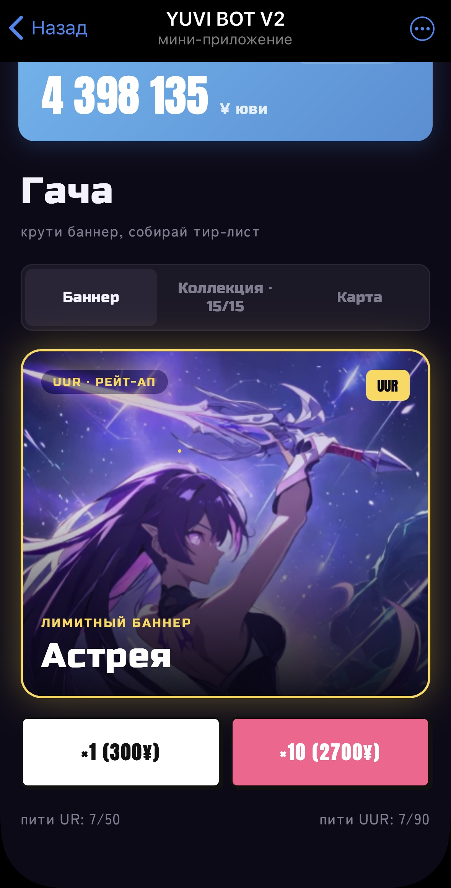
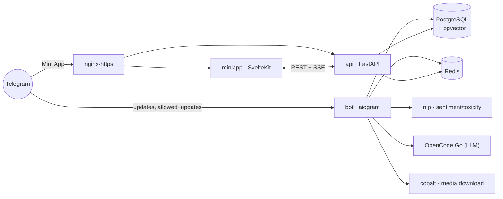

# 🎮 Yuvi Bot v2


Telegram-бот для геймификации одного дружеского группового чата: бот живёт в чате, собирает 100% активности (сообщения, реакции, медиа, реплаи) и превращает общение в игру — статистика, AI-команды, экономика «ювики», казино в Mini App, рынки ставок, гача, дуэли.

> Полная переработка с нуля заброшенного проекта [Yuvi-bot](https://github.com/Hainox/Yuvi-bot) (код не перенесён — только идеи фич); архитектурный эталон — [xyloz_tg_bot](https://github.com/Heide172/xyloz_tg_bot).

Бот не прототип — он реально работает в чате прямо сейчас: собирает 100% сообщений, отвечает на 70+ команд, считает экономику, открывает полноценный Mini App с 5 казино-играми, продаёт соц-механики и скачивает медиа по ссылке из TikTok/Reels/Shorts через self-hosted `cobalt`.

<p align="center">
  
  
  
</p>
<p align="center"><sub>Хаб Mini App → казино-слот с каскадами и дрель-хантом → гача-баннер с коллекцией персонажей.</sub></p>

## Оглавление

- [Зачем этот репозиторий](#зачем-этот-репозиторий)
- [Статус](#статус-все-9-фаз-готовы-100)
- [Архитектура](#архитектура)
- [Что умеет бот](#что-умеет-бот)
- [Технологический стек](#технологический-стек)
- [Структура проекта](#структура-проекта)
- [Быстрый старт](#быстрый-старт-локально)
- [Обязательные настройки Telegram](#обязательные-настройки-telegram)
- [Переменные окружения](#переменные-окружения)
- [Backfill истории чата](#backfill-истории-чата)
- [Тесты](#тесты)
- [Для кого этот README](#для-кого-этот-readme)

## Зачем этот репозиторий

Главная цель — **надёжно собирать данные чата без потерь**, потому что вся статистика, AI-команды и экономика строятся поверх этих данных: если что-то другое сломается, сбор должен продолжаться.

## Статус: все 9 фаз готовы (100%)

| Фаза | Что | Статус |
|---|---|---|
| 1 | Сбор данных и статистика | ✅ Готово |
| 2 | AI-команды и NLP-аналитика | ✅ Готово |
| 3 | Экономика и рынки ставок | ✅ Готово |
| 4 | Mini App: backend-фундамент | ✅ Готово |
| 4.1 | Mini App: игровые сервисы (казино/ферма/гача/дуэли) | ✅ Готово |
| 4.2 | Mini App: SvelteKit-фронтенд | ✅ Готово |
| 4.3 | Mini App: админ-панель + nginx/HTTPS деплой | ✅ Готово |
| 5 | Ежедневные ритуалы, теги, AI-двойник | ✅ Готово |
| 6 | Платные фичи, финальный релиз | ✅ Готово |

Активная разработка продолжается поверх готового фундамента — актуальный бэклог и новые слот-концепты см. `docs/roadmap.md`.

## Архитектура

**Сначала сбор данных и целостность, потом фичи.**



Важные архитектурные решения:
- сбор сообщений через middleware, чтобы команды не терялись;
- explicit `allowed_updates` с поддержкой реакций;
- append-only журнал экономики и идемпотентные денежные операции (`ref_id`/`idem_key` + `SELECT ... FOR UPDATE`);
- все фоновые задачи через APScheduler (без RQ/отдельного worker-контейнера);
- русский язык документации и простой стиль для входа в проект.

## Что умеет бот

### Сбор данных (фундамент)

- 100% сообщений через middleware (не catch-all — команды не теряются)
- Реакции, реплаи/тред-цепочки, эмодзи, стикеры, медиа, форварды
- Частотные словари слов и эмодзи
- Backfill истории чата через личный Telegram-аккаунт (Pyrogram/Kurigram userbot)

### 📊 Статистика

`/mystats` `/chatstats` `/who` `/streak` `/peakday` `/words`

### 🤖 AI-команды (LLM через OpenCode Go)

`/summary` `/digest` `/card` `/ask` `/topics` `/phrase` `/joke` `/mood` `/toxic`
Ответы стримятся прямо в сообщение. Админ: `/model_show` `/model_list` `/model_set` `/model_health` `/prompt_show` `/prompt_set` `/prompt_reset`

### 💰 Экономика «ювики»

`/balance` `/transfer` `/leaderboard` `/economy` `/rules`
Банк чата, append-only журнал транзакций, идемпотентные денежные операции. Админ: `/grant` `/grant_all` `/giveaway`

### 📈 Рынки ставок (parimutuel)

`/markets` `/market` `/market_create` `/bet` `/portfolio`
Импорт рынков с Polymarket/Manifold с авторезолюцией. Админ: `/market_resolve` `/market_cancel`

### ⚔️ Дуэли

`/duel` `/duelbot` `/duel_accept` `/duel_decline` `/duel_cancel`
Ставки на исход, автоматический мут проигравшего. Админ: `/unmute`

### 🔄 Биржа (P2P-обмен ювиков)

`/exchange` `/exchange_create` `/exchange_claim` `/exchange_cancel` `/exchange_confirm`
Продавец выставляет ювики на продажу со свободным описанием желаемой оплаты — сама оплата происходит вне бота, между двумя участниками. Бот эскроирует только ювик-сторону сделки (escrow → claim → продавец подтверждает получение оплаты и освобождает эскроу). Админ: `/exchange_admin_cancel` `/exchange_admin_release` (разрешение споров по зависшим сделкам).

### 🎰 Mini App «Казино» (открывается кнопкой в закреплённом сообщении чата)

SvelteKit-приложение с живым обновлением баланса (SSE):
- **Игры**: слоты (с анимированным барабаном и прогрессивным джекпотом), рулетка, блэкджек, кости, монетка
- **Ферма**: тапалка → CP → конвертация в ювики, апгрейды, офлайн-накопление автокликером
- **Гача**: роллы ×1/×10, 15 героинь в 4 тирах редкости (R/S/UR/UUR), pity-система, бонусы созвездий (в игровой логике сейчас применяется только бонус CP/сек с фермы, остальные категории каталогизированы, но пока не подключены)
- **Соц-экраны**: лидерборд, история операций, переводы, правила, лента «Что нового»
- Админ: `/farmwipe`

### 🎉 Ежедневные ритуалы и теги

- `/awards` — номинации дня (главный по сообщениям, матершинник, больше всех фото и т.д.), автопост ≈23:55 МСК
- `/yuvi` — ежедневная лотерея, сброс в 00:00 МСК
- `/quests` — ежедневные квесты и достижения, разблокируют бонусные уровни фермы (до 99)
- `/victim` — «жертва дня»: приз из банка чата + временный тег + экономический дебафф на 24ч
- `/tag_rent` `/tag_cancel` — аренда видимого Telegram-тега (custom_title) за ювики

### 🧬 AI-двойник (Twin)

`/twin` `/twin_optin` `/twin_optout` `/twin_pause` `/twin_resume` `/twin_status`
AI-двойник участника на основе поведенческого профиля, работает только по явному согласию (opt-in).

**Дневной двойник**: раз в день из уже согласившихся на `/twin` случайно выбирается один участник — весь день бот изредка постит от его имени реплики в чате и отвечает на реплаи к своим постам (в том числе на упоминания). Согласие переиспользуется от обычного `/twin`, отдельного opt-in нет; `/twin_pause` в середине дня сразу останавливает посты от имени этого человека. Админ: `/daily_twin_off` `/daily_twin_on`.

### 🛍️ Соцмагазин

`/poke` `/hug` `/joke_order` `/roast`
Платные взаимодействия с другим участником чата — списание ювиков в банк чата.

### 📥 Скачивание медиа

Просто отправь в чат ссылку на TikTok / Instagram Reels / YouTube Shorts — бот сам распознает её (без команды) и пришлёт видео через self-hosted сервис `cobalt`. Списание ювиков — **только при успешном скачивании** (если ссылка не открылась — деньги не списываются). Дневной лимит на пользователя, админ-kill-switch: `/media_dl_off` `/media_dl_on`.

### 📮 Фидбек

`/fb <текст>` (в чате) или AI-чат-ассистент в Mini App — заявка попадает в админ-панель; при закрытии заявки с типом баг/идея автор получает награду ювиками.

### 🛠️ Служебное

`/backfill` (админ, запуск загрузки истории) · `/post_update` (админ, публикация записи в ленту «Что нового») · `/test_jackpot` `/test_lurker` (админ, ручные тест-триггеры визуального формата, без движения денег)

## Технологический стек

| Блок | Стек |
|---|---|
| Bot | Python 3.11, aiogram 3.x (async) |
| API | FastAPI |
| NLP | FastAPI + transformers (CPU-контейнер, sentiment/toxicity) |
| Данные | PostgreSQL + pgvector, Redis |
| ORM и миграции | SQLAlchemy 2 (async), Alembic |
| Mini App | SvelteKit 2 + TypeScript, nginx |
| AI-провайдер | OpenCode Go (OpenAI-совместимый API) |
| Скачивание медиа | self-hosted `cobalt` (внутренний docker-сервис, без внешнего порта) |
| Деплой | docker-compose на VPS Ubuntu (8 сервисов) |

## Структура проекта

```text
Yuvi Bot v2/
├── bot/                  # Telegram-бот (aiogram)
│   ├── handlers/         # Обработчики команд
│   ├── services/         # Бизнес-логика
│   └── middleware/       # Сбор сообщений (OuterMiddleware)
├── api/                  # FastAPI backend для Mini App
│   └── routes/           # /economy, /games, /farm, /gacha, /duel, /markets, /exchange, /stats
├── nlp/                  # FastAPI NLP-сервис (sentiment/toxicity)
├── miniapp/               # SvelteKit фронтенд Mini App
│   └── src/routes/       # Хаб + игровые/соц-экраны
├── webapp/                # Ранний React/JSX прототип (заменён на miniapp/)
├── common/                # Общие db/models
├── migrations/            # Alembic
├── docs/                  # Документация проекта
│   ├── refscan/           # Разбор архитектуры/данных эталонных репозиториев
│   └── assets/screenshots/
├── scripts/                # Вспомогательные скрипты (backfill, run-local.ps1)
├── tests/                  # pytest — бизнес-логика бота/API
├── docker-compose.yml
├── .env.example
└── README.md
```

## Быстрый старт (локально)

1. Скопируй переменные окружения:
   ```bash
   cp .env.example .env
   ```
2. Заполни обязательные поля в `.env` (минимум): `BOT_TOKEN`, `CHAT_ID`, `DATABASE_URL`, `REDIS_URL`, `OPENAI_API_KEY`.
3. Подними стек:
   ```bash
   docker compose up --build
   ```
   `docker-compose.yml` сам поднимает `postgres`+`redis`, применяет миграции (`migrations`-сервис) и запускает `bot`/`api`/`nlp`/`miniapp`.
4. Проверь, что всё живо:
   - API: `http://localhost:8002/docs`
   - NLP: `http://localhost:8001/health`
   - Mini App: `http://localhost:8003`
   - Bot: любая команда из списка выше в Telegram-чате, где бот состоит.
5. Для реального открытия Mini App из группы нужен HTTPS-туннель (ngrok/cloudflared) или продакшен-деплой с nginx (Фаза 4.3) — Telegram не открывает Mini App по обычному HTTP.

Продакшен-деплой на VPS Ubuntu (полный стек из 8 сервисов, включая `cobalt`): `docs/deploy-vps-ubuntu.md`.

Чеклисты «как проверить, что всё работает»: `docs/how-to-verify-phase1.md` (сбор данных/статистика) и `docs/how-to-verify-phase6.md` (платные фичи — соцмагазин, медиа, фидбек).

## Обязательные настройки Telegram

> **Критично**: BotFather → Group Privacy = OFF, иначе бот не увидит все сообщения и сбор данных будет неполным.

Подробно, включая права на реакции и закреп сообщений: `docs/botfather-setup.md`.

## Переменные окружения

Полный список с комментариями: `.env.example`.

## Backfill истории чата

Bot API не отдаёт сообщения старше момента добавления бота — для загрузки истории нужен личный Telegram-аккаунт (`TG_API_ID`/`TG_API_HASH`, НЕ токен бота). Подробно: `docs/backfill-setup.md`.

## Тесты

```bash
docker run --rm --network yuvibotv2_default --env-file .env -v "$(pwd)":/app -w /app yuvi-bot-dev:py311 pytest -q
```

Держим 900+ pytest-тестов на бизнес-логику против живого Postgres/Redis (не моки).

## Для кого этот README

Написан специально простым языком: чтобы даже при минимальном опыте программирования можно было понять архитектуру, поднять проект и развивать его дальше поэтапно.
